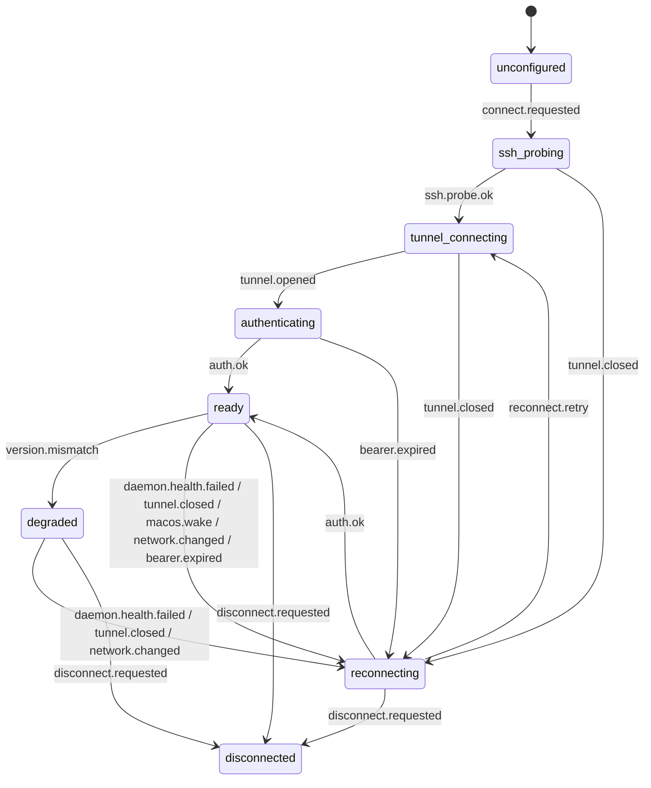

# Reconnect and Replay

This note records the Phase 2.5 reconnect contract for byte-addressable job
logs. Event replay uses the transport sequence cursor; job logs use persisted
byte offsets because terminal/build output can exceed the in-memory event ring.

## ConnectionManager FSM

The desktop owns the SSH tunnel and websocket lifecycle through a single
`ConnectionManager` FSM. Diagnostics reads `diagnosticsSnapshot()` from
`apps/desktop/src/main/connection/ConnectionManager.ts`; that snapshot contains
the current `TunnelSnapshot` plus the last 20 transitions with the trigger,
fault, retry count, timestamp, and human-readable reason.



| Trigger | Source | Next action | Diagnostics reason |
| --- | --- | --- | --- |
| `connect.requested` | Wizard or user reconnect action | Probe the saved SSH profile and readable key. | User or wizard requested a connection. |
| `ssh.probe.ok` | Profile/key preflight | Open the SSH tunnel to the daemon port. | SSH profile passed local preflight checks. |
| `tunnel.opened` | `ssh2` tunnel driver | Authenticate and mint/refresh websocket credentials. | SSH tunnel opened a local daemon port. |
| `auth.ok` | Auth bridge | Mark the connection ready and reset reconnect attempts. | Daemon bearer and websocket token were accepted. |
| `daemon.health.failed` | `/v1/health` heartbeat | Close stale handle and enter bounded reconnect backoff. | Daemon health check failed. |
| `tunnel.closed` | SSH close/error event | Close stale handle and enter bounded reconnect backoff. | SSH tunnel closed. |
| `macos.wake` | `powerMonitor` resume | Revalidate the tunnel rather than trusting a pre-sleep socket. | macOS woke from sleep; tunnel must be revalidated. |
| `network.changed` | Network change signal | Revalidate the tunnel with jittered backoff. | Network changed; tunnel may be stale. |
| `bearer.expired` | HTTP 401 / auth bridge | Reconnect and refresh daemon credentials before resubscribe. | Bearer expired and must be refreshed. |
| `version.mismatch` | `/v1/version` compatibility check | Enter degraded mode; keep the tunnel open for diagnostics. | Daemon API version is incompatible. |
| `disconnect.requested` | Explicit user action | Stop reconnecting and close the local tunnel. | User requested disconnect. |
| `reconnect.retry` | Backoff timer | Retry tunnel open and authentication. | Backoff elapsed and reconnect retry started. |

Reconnect backoff starts at 1s, doubles per failure, applies +/-25% jitter,
and caps at 30s. The reconnect path always follows the same order: tunnel
check, bearer/session check, websocket-token refresh, subscription with
sequence cursors, snapshot fetch for any channel that reports a gap, then
active-project clone reconciliation.

## Job Log Offsets

Clients read log bytes with:

```http
GET /v1/jobs/{jobId}/log?offset=<bytes>&maxBytes=<n>
```

The response body is raw `application/octet-stream` data from the persisted log
file. A client should persist the returned `X-Log-Next-Offset` value after each
successful response. After a tunnel drop or renderer restart, it resumes by
requesting that offset.

The daemon sets:

- `Content-Range`: byte range returned, or `bytes */<total>` for an empty chunk.
- `X-Log-Total-Bytes`: total bytes currently persisted for the job.
- `X-Log-Final`: `true` when the job is terminal.
- `X-Log-Next-Offset`: offset to use for the next request.

`maxBytes` is bounded by the daemon so a reconnect cannot force an unbounded
read. If omitted, the daemon uses the default chunk size. The legacy `limit`
query parameter is accepted by the daemon handler for seed-contract callers, but
new clients should send `maxBytes`.

## Polling Active Logs

For an active job, an empty response with `X-Log-Final: false` means the client
is caught up, not that the stream is complete. The client keeps the same offset
and polls again after its normal backoff.

For a terminal job, `X-Log-Final: true` plus an empty response at the current
offset means all persisted bytes have been observed.
