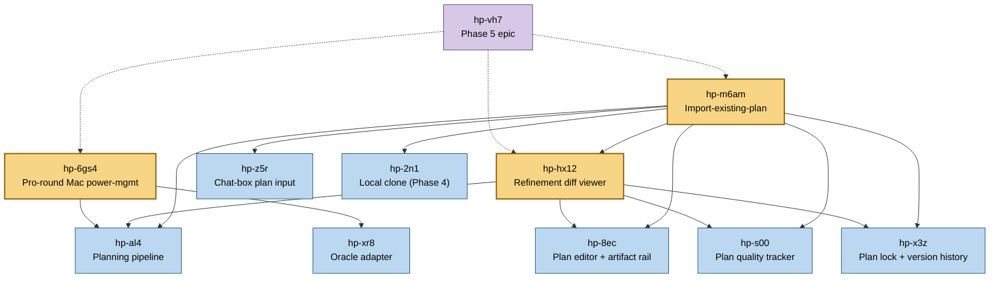

# Round 6 Deltas — Bead Graph Subgraph

**Generated:** 2026-05-02 from 207-bead graph (round 6 added 7 beads + 75 edges).

Solid arrows = blocker edges (`A --> B` means A is blocked by B).
Dashed arrows = parent rollup (`epic -.-> child` means epic blocks until child closes).
Round-6 beads are highlighted in cream.

---

## Diagram 1 — High-level rollup view

The 7 round-6 beads + their parent epics + the 5 foundation blockers used by all of them.

```mermaid
graph TD
    classDef new fill:#f8d585,stroke:#8a5a00,stroke-width:2px,color:#000
    classDef epic fill:#d8c8e8,stroke:#5a4080,stroke-width:1px,color:#000
    classDef foundation fill:#cde6cd,stroke:#3a7a3a,stroke-width:1px,color:#000

    %% Round-6 beads
    HP_6GS4["hp-6gs4<br/>Pro-round Mac power-mgmt"]:::new
    HP_1WG8["hp-1wg8<br/>Audit log explorer UI"]:::new
    HP_HX12["hp-hx12<br/>Refinement diff viewer"]:::new
    HP_X14E["hp-x14e<br/>Project switcher + restore"]:::new
    HP_HRSV["hp-hrsv<br/>Notification Center + dock"]:::new
    HP_M6AM["hp-m6am<br/>Import-existing-plan"]:::new
    HP_FED6["hp-fed6<br/>Bead Rounds view modal"]:::new

    %% Parent epics
    HP_VH7["hp-vh7<br/>Phase 5 epic"]:::epic
    HP_WKK["hp-wkk<br/>Phase 13 polish epic"]:::epic
    HP_JXE["hp-jxe<br/>Phase 4 epic"]:::epic
    HP_V6N["hp-v6n<br/>Phase 9 epic"]:::epic
    HP_5CR["hp-5cr<br/>Phase 7 epic"]:::epic

    %% Foundation blockers
    HP_R3I["hp-r3i<br/>schemas"]:::foundation
    HP_Z1X["hp-z1x<br/>4-stage shell"]:::foundation
    HP_ELX["hp-elx<br/>design system"]:::foundation
    HP_LXS["hp-lxs<br/>structured logging"]:::foundation
    HP_G73["hp-g73<br/>audit log infra"]:::foundation

    %% Parent rollup (dashed)
    HP_VH7 -.-> HP_6GS4
    HP_VH7 -.-> HP_HX12
    HP_VH7 -.-> HP_M6AM
    HP_WKK -.-> HP_1WG8
    HP_JXE -.-> HP_X14E
    HP_V6N -.-> HP_HRSV
    HP_5CR -.-> HP_FED6

    %% Round-6 → foundation (all 7 → r3i, z1x, elx, lxs)
    HP_6GS4 --> HP_R3I
    HP_6GS4 --> HP_Z1X
    HP_6GS4 --> HP_ELX
    HP_6GS4 --> HP_LXS
    HP_6GS4 --> HP_G73

    HP_1WG8 --> HP_R3I
    HP_1WG8 --> HP_Z1X
    HP_1WG8 --> HP_ELX
    HP_1WG8 --> HP_LXS

    HP_HX12 --> HP_R3I
    HP_HX12 --> HP_Z1X
    HP_HX12 --> HP_ELX
    HP_HX12 --> HP_LXS

    HP_X14E --> HP_R3I
    HP_X14E --> HP_Z1X
    HP_X14E --> HP_ELX
    HP_X14E --> HP_LXS
    HP_X14E --> HP_G73

    HP_HRSV --> HP_R3I
    HP_HRSV --> HP_Z1X
    HP_HRSV --> HP_ELX
    HP_HRSV --> HP_LXS
    HP_HRSV --> HP_G73

    HP_M6AM --> HP_R3I
    HP_M6AM --> HP_Z1X
    HP_M6AM --> HP_ELX
    HP_M6AM --> HP_LXS
    HP_M6AM --> HP_G73

    HP_FED6 --> HP_R3I
    HP_FED6 --> HP_Z1X
    HP_FED6 --> HP_ELX
    HP_FED6 --> HP_LXS
    HP_FED6 --> HP_G73

    %% Cross round-6 edges (round-6 beads depending on each other)
    HP_M6AM --> HP_HX12
    HP_HRSV --> HP_1WG8
```

---

## Diagram 2 — Phase 5 cluster (hp-6gs4 / hp-hx12 / hp-m6am + Phase-5-specific blockers)

The three Phase 5 round-6 beads share heavy structure: planning pipeline, plan editor, quality tracker, lock semantics. This zooms in on those.

---

## Diagram 3 — UI / surface cluster (hp-1wg8 / hp-hrsv / hp-x14e / hp-fed6 + UI-specific blockers)

The four "UI surface" round-6 beads cluster around shell + design-system + Activity panel + Settings + Diagnostics consumers.

```mermaid
graph TD
    classDef new fill:#f8d585,stroke:#8a5a00,stroke-width:2px,color:#000
    classDef epic fill:#d8c8e8,stroke:#5a4080,stroke-width:1px,color:#000
    classDef ui fill:#f0c8d8,stroke:#80204f,stroke-width:1px,color:#000

    HP_1WG8["hp-1wg8<br/>Audit log explorer UI"]:::new
    HP_HRSV["hp-hrsv<br/>Notification Center + dock"]:::new
    HP_X14E["hp-x14e<br/>Project switcher + restore"]:::new
    HP_FED6["hp-fed6<br/>Bead Rounds view modal"]:::new

    HP_WKK["hp-wkk<br/>Phase 13 polish"]:::epic
    HP_V6N["hp-v6n<br/>Phase 9 epic"]:::epic
    HP_JXE["hp-jxe<br/>Phase 4 epic"]:::epic
    HP_5CR["hp-5cr<br/>Phase 7 epic"]:::epic

    HP_ZIR["hp-zir<br/>main.ts decompose"]:::ui
    HP_I62["hp-i62<br/>component set"]:::ui
    HP_JE1P["hp-je1p<br/>redaction layer"]:::ui
    HP_1RY["hp-1ry<br/>REST contract"]:::ui
    HP_1R4["hp-1r4<br/>Activity drawer UI"]:::ui
    HP_3SE["hp-3se<br/>Agent Mail urgent ingest"]:::ui
    HP_WG5P["hp-wg5p<br/>Settings UI"]:::ui
    HP_SPX["hp-spx<br/>Project activate"]:::ui
    HP_ILT["hp-ilt<br/>Project create/import"]:::ui
    HP_4BT["hp-4bt<br/>Settings store (3-store)"]:::ui
    HP_9XTT["hp-9xtt<br/>Migration runner"]:::ui
    HP_XI9["hp-xi9<br/>Polish-rounds jobs"]:::ui
    HP_OJH["hp-ojh<br/>Plan-to-beads conversion"]:::ui
    HP_0BA["hp-0ba<br/>Bead detail drawer"]:::ui

    HP_WKK -.-> HP_1WG8
    HP_V6N -.-> HP_HRSV
    HP_JXE -.-> HP_X14E
    HP_5CR -.-> HP_FED6

    HP_1WG8 --> HP_ZIR
    HP_1WG8 --> HP_I62
    HP_1WG8 --> HP_JE1P
    HP_1WG8 --> HP_1RY

    HP_HRSV --> HP_ZIR
    HP_HRSV --> HP_1R4
    HP_HRSV --> HP_3SE
    HP_HRSV --> HP_WG5P
    HP_HRSV --> HP_1WG8

    HP_X14E --> HP_ZIR
    HP_X14E --> HP_I62
    HP_X14E --> HP_SPX
    HP_X14E --> HP_ILT
    HP_X14E --> HP_4BT
    HP_X14E --> HP_9XTT

    HP_FED6 --> HP_I62
    HP_FED6 --> HP_JE1P
    HP_FED6 --> HP_1RY
    HP_FED6 --> HP_XI9
    HP_FED6 --> HP_OJH
    HP_FED6 --> HP_0BA
```

---

## Cycle-resolution audit trail

Round 6 hit two cycles during dep wiring. Both routes shown for the record:

| Round-6 bead | Initial parent attempt | Cycle path | Re-route to |
|---|---|---|---|
| hp-1wg8 (audit explorer) | hp-g73 (audit-log epic) | hp-g73 → hp-1wg8 → hp-elx → hp-8dym → hp-g6sp → hp-g73 (the design-system → renderer-error-UX → problem+json producer chain transitively reaches audit infra) | **hp-wkk** (Phase 13 polish — Diagnostics surfaces logically belong here) |
| hp-fed6 (Rounds modal) | hp-9kt (Phase 6 epic) | hp-9kt → hp-fed6 → hp-0ba → hp-9kt (bead detail drawer is already a Phase 6 child) | **hp-5cr** (Phase 7 epic — natural home of the Rounds view per §7.2's view list: Kanban / DAG / Force / drawer / **Rounds**) |

---

## Stat summary

| Dimension | Round 5 end | Round 6 end | Δ |
|---|---|---|---|
| Beads total | 200 | 207 | +7 |
| Edges | 854 | 929 | +75 (68 blocker + 7 parent) |
| Cycles | 0 | 0 | — |
| JSONL bytes | 902,660 | 991,782 | +89 KB |
| Top pick | hp-r3i (0.539, unblocks 8) | hp-r3i (0.540) | stable |
| Top bottleneck | hp-9kt (3626) | hp-9kt (3986) | +360 |
| Phase 5 epic (hp-vh7) | 3150 | 3498 | +348 (3 round-6 children) |
| P0/P1/P2/P3 | 77/99/20/4 | 77/105/21/4 | +6 P1, +1 P2 |
